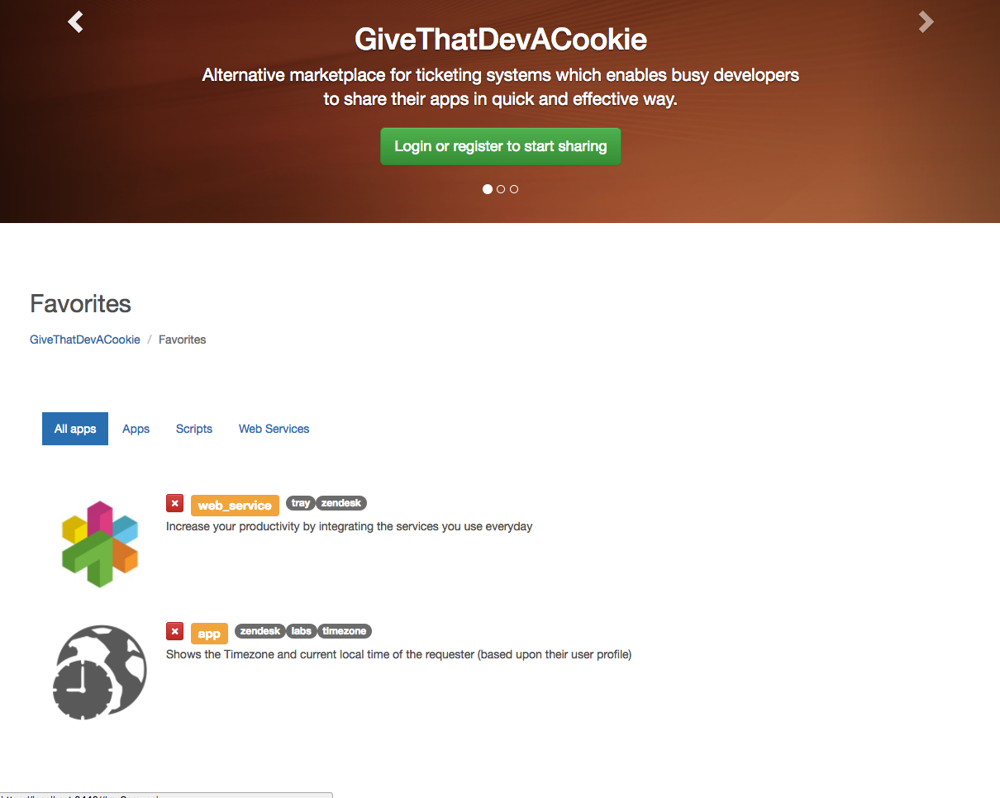

# GiveThatDevACookie

*THIS IS EDUCATIONAL PROJECT FROM COURSERA.COM*

Alternative app marketplace for cloud based ticketing systems like zendesk.com. Busy developers who are making great apps but has no time for marketing, branding and other laborious tasks can quickly advertise their apps.

Currently for submitting an app on official marketplace it requires quite a few steps:
 	Create an app itself
 	Answer branding requirements (icons, images, other branding assets)
 	Write all sort of descriptions
 	Create account with stripe.com
 	Submit an app and wait for approval

Not every busy developer will be happy going through all these steps. For some of them this can be a showstopper. Developers want to code – not do marketing. These obstacles may result in number of great ideas not seeing the world.

Alternative app marketplace will enable developers to advertise their apps by providing minimum information. This should encourage talented coders to build great apps and do not worry about all related activities.

Visitors of alternative app marketplace (ticketing system administrators or other developers) will have another great place where they can look for solutions they need.

Cloud based ticketing platforms such as zendesk.com may use alternative app marketplace to look for great apps or talented authors and help them developing their ideas. Alternative app marketplace is another community place for industry developers.

## How to run

App will serve `dist` folder and REST API via `https`

1. `npm install`
2. `npm start`

*[!] You need running MongoDB instance. Update config.js file with your MongoDB URL*

## How to work with

To modify Angular client go to `Public` folder where Angular application is
To modify server side use folders & files in `root` folder

## Reports

To give better context about application structure please refer to reports below.

You can download report from `/reports` folder

[UI Design and Prototyping Report](reports/ideation.pdf)

[Alternative App Marketplace for cloud based ticketing software](reports/design.pdf)

[Application Design and Software Structure Report](reports/structure.pdf)

[Final Report](reports/final.pdf)

## Screenshots

